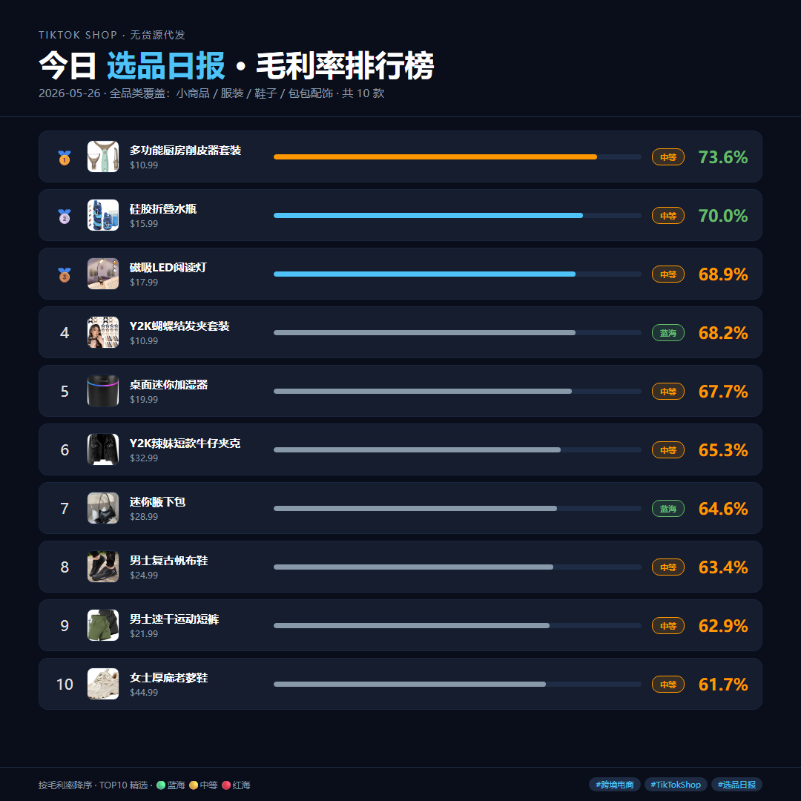
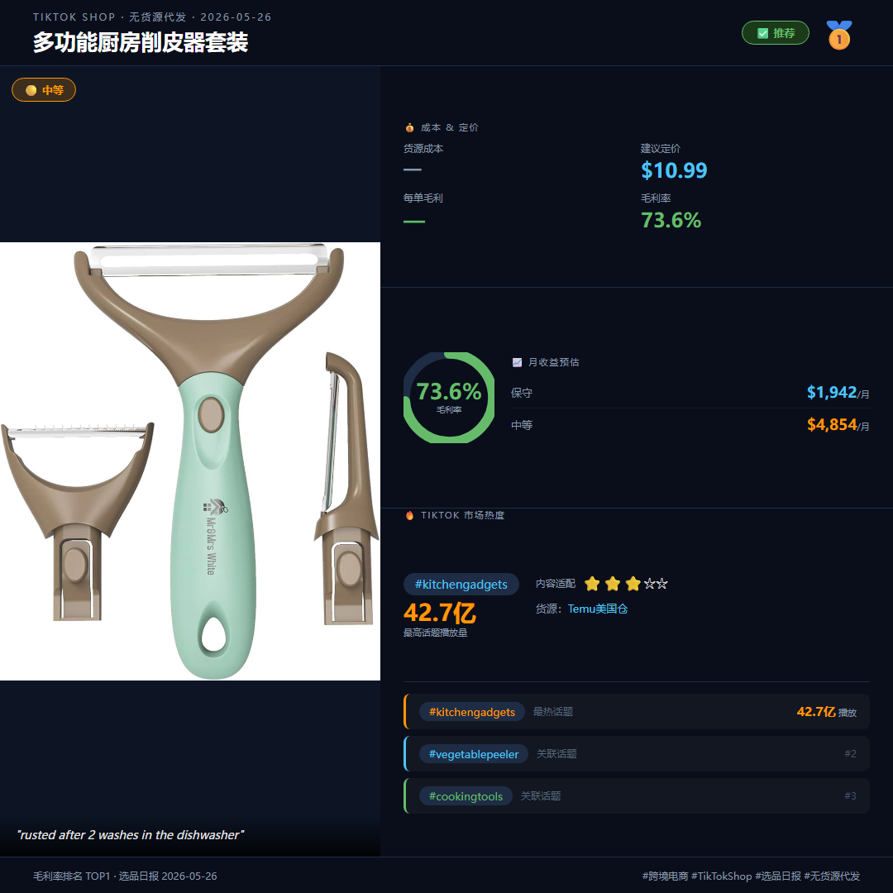
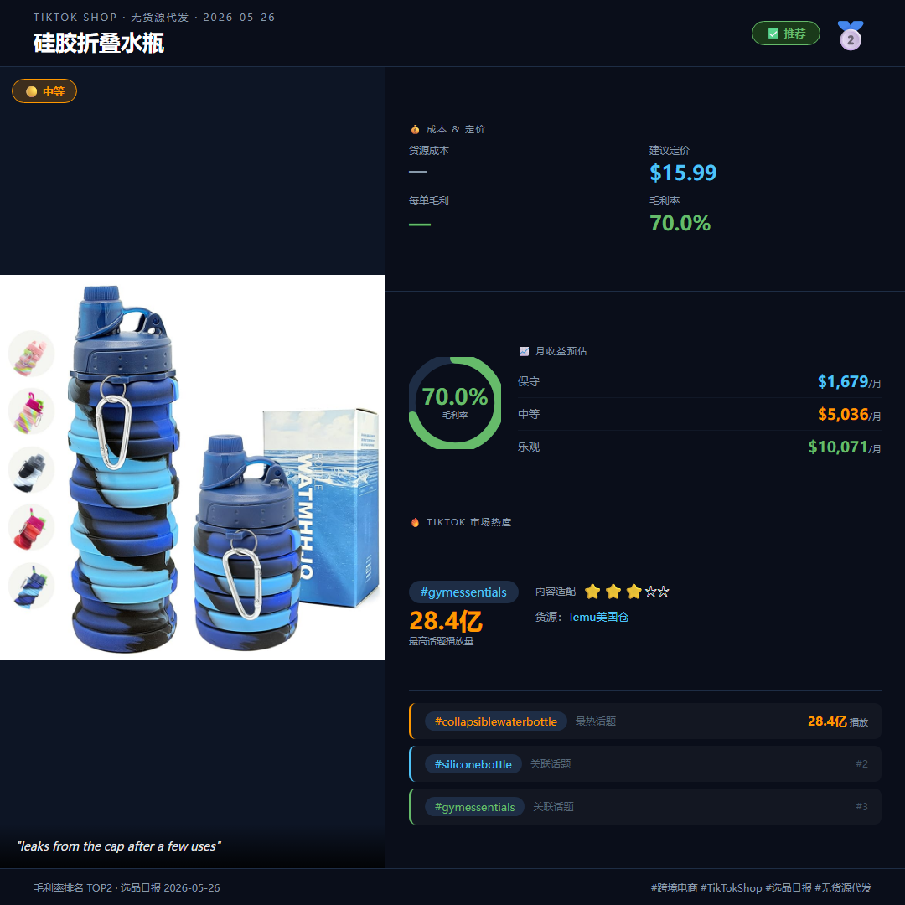
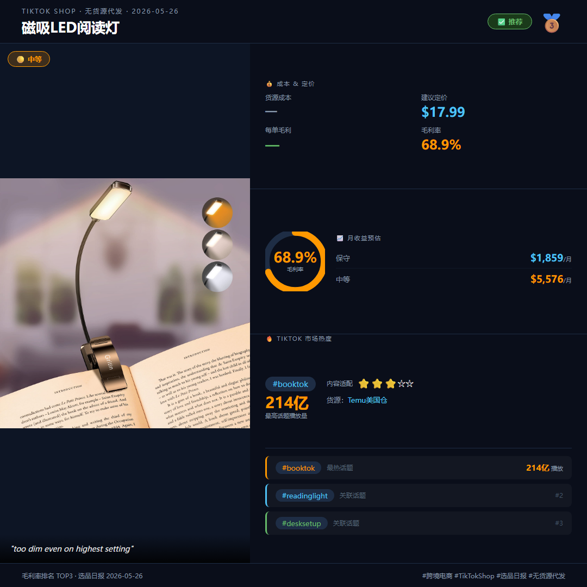

# 🛍️ TikTok Shop 无货源代发 · 选品自动化系统

[](https://github.com/qq773901406-cmd/shop-dropshipping-automation/stargazers)
[](https://opensource.org/licenses/MIT)
[](https://github.com/qq773901406-cmd/shop-dropshipping-automation)
[](https://github.com/qq773901406-cmd/shop-dropshipping-automation)

> 每天 09:30 自动完成「选品分析 → 下载素材 → 生成卡片 → 多平台发布 → 企微推送」全链路，零人工干预。

---

## 📸 效果预览

**封面汇总图（每日自动生成）**



**单品详情卡片（含利润分析）**

| | | |
|:---:|:---:|:---:|
|  |  |  |

---

## 🚀 核心功能

### 1. 智能选品分析
- AI 自动选出 10 款潜力商品（家居/厨房/数码/服装/鞋包）
- 每款输出完整 6 文件：全链路分析 / 货源比价 / 定价表 / 视频脚本 / 双语文案 / 图片素材

### 2. 自动下载商品图片
- 通过 CloakBrowser（反检测浏览器）搜索并下载真实商品图
- 支持中文商品名 → 英文关键词自动映射

### 3. 生成发布卡片图
- 自动生成 9 张 PNG：1 张封面汇总 + 8 张单品利润卡片
- 包含：商品名、利润率、月销量、平台建议零售价、建议进货价

### 4. 一键多平台发布
| 平台 | 语言 | 状态 |
|------|------|------|
| 抖音 | 中文 | ✅ |
| 小红书 | 中文 | ✅ |
| B站 | 中文 | ✅ |
| 微博 | 中文 | ✅ |
| 知乎 | 中文 | ✅ |
| Instagram | 英文 | ✅ |
| Facebook | 英文 | ✅ |
| YouTube 社区 | 英文 | ✅ |

### 5. 企微日报推送
- 自动打包当日分析文件（zip）发送到企业微信群
- 附上 10 款商品利润对比 + 优先上架 TOP3 建议

---

## 🗂️ 项目结构

```
shop-dropshipping-automation/
├── fetch_product_imgs.py          # 商品图片下载脚本（CloakBrowser）
├── scripts/
│   └── daily_pipeline.md          # 定时任务配置文档
├── tools/
│   ├── card-generator/            # 发布卡片图生成器（Node.js + Puppeteer）
│   │   └── index.js
│   └── publisher/                 # 多平台自动发布工具
│       ├── index.js               # 发布入口
│       ├── platforms/             # 各平台 Playwright 脚本
│       │   ├── douyin.js
│       │   ├── bilibili.js
│       │   ├── weibo.js
│       │   ├── zhihu.js
│       │   ├── instagram.js
│       │   ├── facebook.js
│       │   └── youtube.py         # YouTube 社区帖（CloakBrowser）
│       └── utils/                 # Cookie 管理、Cookie 提取工具
├── skills/                        # AI 分析技能包（跨境选品、竞品分析等）
│   └── cross-border-ecommerce/
├── output/                        # 每日输出（已 .gitignore 排除）
│   └── YYYY-MM-DD/
│       └── {商品名}/
│           ├── 01_全链路分析.md
│           ├── 02_货源比价.md
│           ├── 03_价格单.md
│           ├── 04_视频脚本.md
│           ├── 05_发布文案.md
│           └── 06_素材/images/
└── docs/                          # README 展示图片
```

---

## ⚙️ 运行流程

```
09:30 定时触发
    │
    ▼
Step 1  AI 选品分析
        选出 10 款商品，每款生成 6 个分析文件
    │
    ▼
Step 2  下载商品图片
        python fetch_product_imgs.py YYYY-MM-DD
    │
    ▼
Step 3  生成发布卡片
        node tools/card-generator/index.js --date YYYY-MM-DD
        → 输出 9 张 PNG（封面 + 单品 ×8）
    │
    ▼
Step 4  多平台发布（并发）
        国内：抖音 / B站 / 微博 / 知乎（中文文案）
        国外：Instagram / Facebook / YouTube（英文文案）
    │
    ▼
Step 5  企微推送
        zip 打包 + 发送到企业微信群
```

---

## 🛠️ 环境要求

- **Node.js** 18+
- **Python** 3.9+
- **CloakBrowser**（用于下载图片 & YouTube 发布）
- **Playwright**（用于其他平台自动化）
- **CodeBuddy Code**（定时任务调度 & AI 选品分析）

---

## 📦 安装

```bash
# 安装 card-generator 依赖
cd tools/card-generator && npm install

# 安装 publisher 依赖
cd tools/publisher && npm install
```

---

## 🔐 安全说明

以下目录已通过 `.gitignore` 排除，**不会上传到仓库**：
- `tools/publisher/cookies/` — 平台登录 Cookie
- `tools/publisher/profiles/` — Playwright 会话档案
- `.cloakbrowser_profile/` — CloakBrowser 浏览器档案
- `output/` — 每日选品分析输出

---

## 📄 License

MIT
